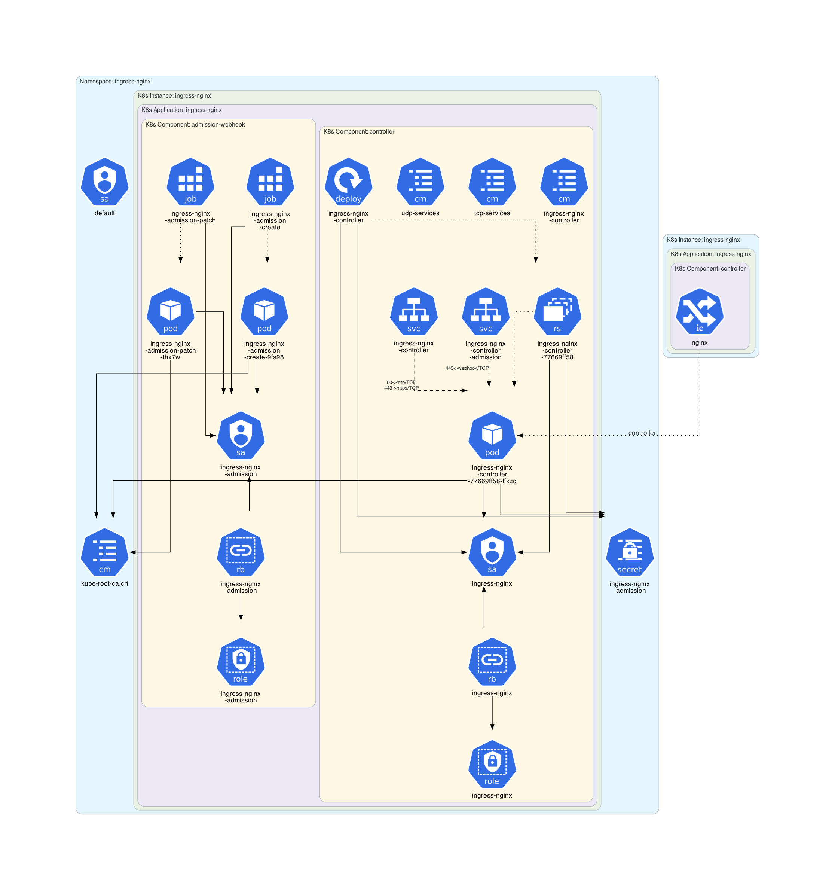

# KubeDiagrams

Generate Kubernetes architecture diagrams from Kubernetes manifest files.

There are several tools to generate Kubernetes architecture diagrams (see **[here](https://github.com/philippemerle/Awesome-Kubernetes-Architecture-Diagrams)**).
The main originality of **KubeDiagrams** is its **[configurability](bin/kube-diagrams.yaml)** allowing for instance to deal with custom Kubernetes resources.

## Examples

Architecture diagram for WordPress manifests:


Architecture diagram for a ZooKeeper manifest:


Architecture diagram of a deployed Cassandra instance:


Architecture diagram of the Minikube Ingress Addon:


All the examples are
* [official Kubernetes WordPress tutorial](examples/wordpress/)
* [official Kubernetes ZooKeeper tutorial](examples/zookeeper/)
* [official Kubernetes Cassandra tutorial](examples/cassandra/)
* [minikube architecture diagrams](examples/minikube/)
* [k0s architecture diagrams](examples/k0s/)
* [Train Ticket](examples/train-ticket/)

## Prerequisites

* [Python 3.x](https://www.python.org/)
* [Diagrams](https://diagrams.mingrammer.com/)
  ```sh
  $ pip install diagrams
  ```
* `dot` command ([Graphviz](https://www.graphviz.org/))

## Usage

```sh
$ kube-diagrams -h
usage: kube-diagrams [-h] [-o OUTPUT] [-f FORMAT] [-c CONFIG] [-v] filename [filename ...]

Generate Kubernetes architecture diagrams from Kubernetes manifest files

positional arguments:
  filename              the Kubernetes manifest filename to process

options:
  -h, --help            show this help message and exit
  -o OUTPUT, --output OUTPUT
                        output diagram filename
  -f FORMAT, --format FORMAT
                        output format, allowed formats are png (default), jpg, svg, pdf, and dot
  -c CONFIG, --config CONFIG
                        custom kube-diagrams configuration file
  -v, --verbose         verbosity, set to false by default
```

## Features

### Kubernetes resources

Supported `kind`/`apiVersion` resource types are 26 ones:
* ClusterRole/rbac.authorization.k8s.io/v1
* ClusterRoleBinding/rbac.authorization.k8s.io/v1
* CustomResourceDefinition/apiextensions.k8s.io/v1
* ConfigMap/v1
* DaemonSet/apps/v1
* Deployment/apps/v1
* Group/rbac.authorization.k8s.io/v1
* HorizontalPodAutoscaler/autoscaling/v2
* Ingress/networking.k8s.io/v1
* IngressClass/networking.k8s.io/v1
* Job/batch/v1
* Namespace/v1
* Node/v1
* PersistentVolume/v1
* PersistentVolumeClaim/v1
* Pod/v1
* PodDisruptionBudget/policy/v1
* ReplicaSet/apps/v1
* Role/rbac.authorization.k8s.io/v1
* RoleBinding/rbac.authorization.k8s.io/v1
* Secret/v1
* Service/v1
* ServiceAccount/v1
* StatefulSet/apps/v1
* StorageClass/storage.k8s.io/v1
* User/rbac.authorization.k8s.io/v1

**Note**: The mapping between these supported Kubernetes resources and architecture diagrams is defined into [bin/kube-diagrams.yml](bin/kube-diagrams.yaml#L24).

**Note**: The mapping for any Kubernetes custom resources can be also defined into **KubeDiagrams** configuration files as illustrated in [examples/k0s/KubeDiagrams.yml](examples/k0s/KubeDiagrams.yml#L10).

Currently, unsupported `kind`/`apiGroup` resource types are 33 ones:
* Binding/
* ComponentStatus/
* Endpoints/
* Event/
* LimitRange/
* PodTemplate/
* ReplicationController/
* ResourceQuota/
* MutatingWebhookConfiguration/
* ValidatingWebhookConfiguration/admissionregistration.k8s.io
* APIService/apiregistration.k8s.io
* ControllerRevision/apps
* TokenReview/authentication.k8s.io
* LocalSubjectAccessReview/authorization.k8s.io
* SelfSubjectAccessReview/authorization.k8s.io
* SelfSubjectRulesReview/authorization.k8s.io
* SubjectAccessReview/authorization.k8s.io
* CronJob/batch
* CertificateSigningRequest/certificates.k8s.io
* Lease/coordination.k8s.io
* EndpointSlice/discovery.k8s.io
* Event/events.k8s.io
* FlowSchema/flowcontrol.apiserver.k8s.io
* PriorityLevelConfiguration/flowcontrol.apiserver.k8s.io
* NodeMetrics/metrics.k8s.io
* PodMetrics/metrics.k8s.io
* NetworkPolicy/networking.k8s.io
* RuntimeClass/node.k8s.io
* PriorityClass/scheduling.k8s.io
* CSIDriver/storage.k8s.io
* CSINode/storage.k8s.io
* CSIStorageCapacity/storage.k8s.io
* VolumeAttachment/storage.k8s.io

## Kubernetes resources clustering

With **KubeDiagrams**, Kubernetes resources can be clustered within the architecture diagrams automatically. **KubeDiagrams** uses the `metadata.namespace` resource field as first clustering criteria. Then, the `metadata.labels` keys can be used to define subclusters. Following table lists the predefined mappings between label keys and cluster titles as defined in the [bin/kube-diagrams.yml](bin/kube-diagrams.yaml#L13) file (see the `clusters` list).

| Label | Cluster Title |
| :--------: | :-------: |
| `app` | Application |
| `service` | Microservice |
| `app.kubernetes.io/instance` | K8s Application |
| `app.kubernetes.io/component` | K8s Component |
| `tier` | Tier |

New mappings can be easily defined in custom configuration files (see [examples/minikube/KubeDiagrams.yml](examples/minikube/KubeDiagrams.yml#L2) and [examples/k0s/KubeDiagrams.yml](examples/k0s/KubeDiagrams.yml#L5)) and provided to **KubeDiagrams** via the `--config` command-line option.

## License

This project is licensed under the GPL-3.0 license - see the [LICENSE](LICENSE) file for details.

## Todo List

* Add more examples
* Add missed Kubernetes resource types as at least CronJob, Endpoint, LimitRange, NetworkPolicy, and ResourceQuota
* Make `nodes/*/edges` more declarative
