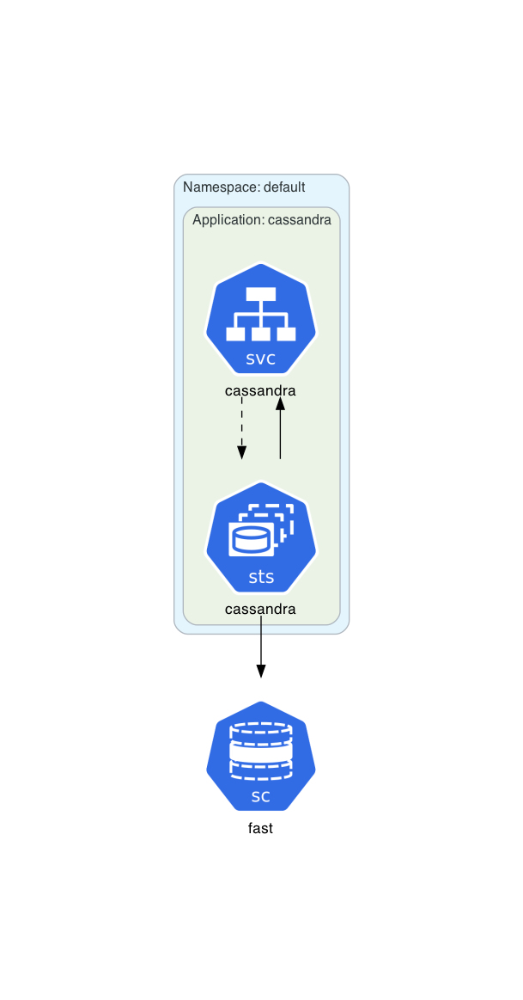
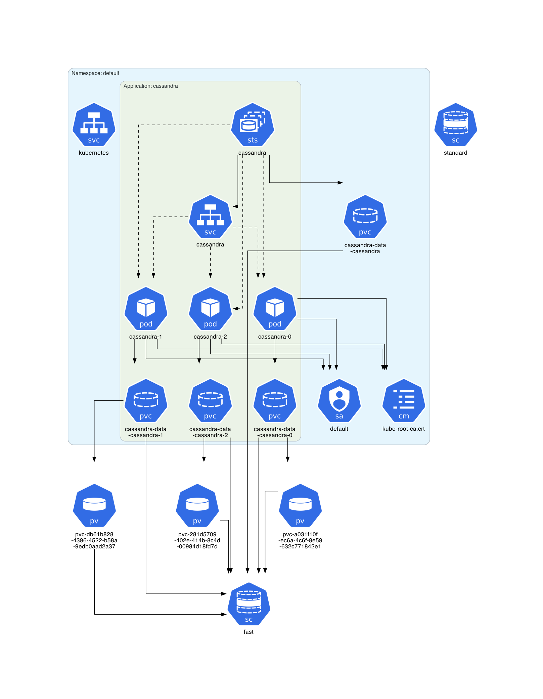

# Cassandra Example

This example is based on the **[official Kubernetes Cassandra tutorial](https://kubernetes.io/docs/tutorials/stateful-application/cassandra/)**.

## Instructions

Generate the Kubernetes architecture diagram for [cassandra.yml](cassandra.yml):
```sh
$ kube-diagrams cassandra.yml
```

Start a minikube cluster:
```sh
$ minikube start --memory 5120 --cpus=4
```

Deploy the Cassandra application:
```sh
$ kubectl apply -f cassandra.yml
```

Wait a few minutes for the Cassandra application to be deployed.

Get all Kubernetes resources in the `default` namespace:
```sh
$ kubectl get all,pvc,serviceaccount,configmap,pv,storageclass -o=yaml > default.yml
```

Generate a Kubernetes architecture diagram for the `default` namespace:
```sh
$ kube-diagrams default.yml
```

Delete Cassandra application.
```sh
$ kubectl delete -f cassandra.yml
```

## Generated architecture diagrams

Architecture diagram for [cassandra.yml](cassandra.yml):


Architecture diagram for a deployed Cassandra instance:

