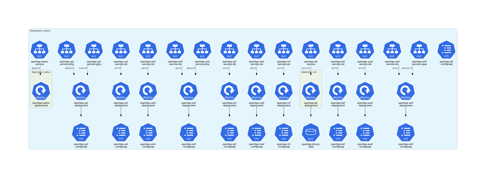
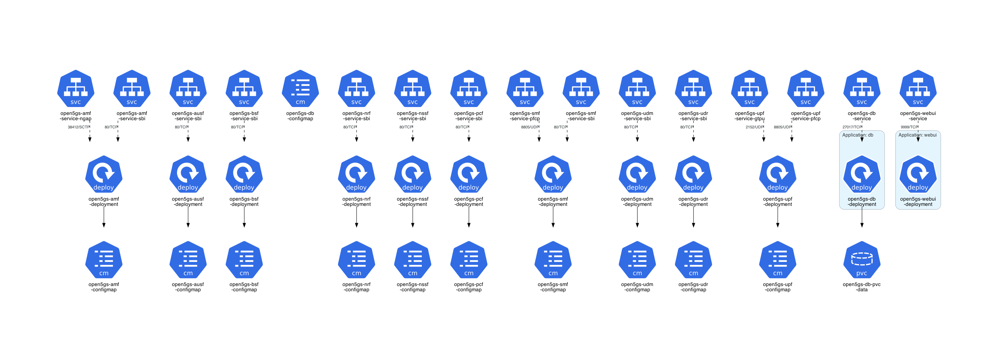

# docker-open5gs Example

This example is based on **[docker-open5gs](https://github.com/Borjis131/docker-open5gs)**.

## Instructions

Generate the Kubernetes architecture diagrams for **docker-open5gs** Helm charts:
```sh
$ ./generate.sh
```

## Generated architecture diagrams

Architecture diagram for **[docker-open5gs](https://github.com/Borjis131/docker-open5gs)**:



Architecture diagram for **[docker-open5gs](https://github.com/Borjis131/docker-open5gs)** without namespace:


