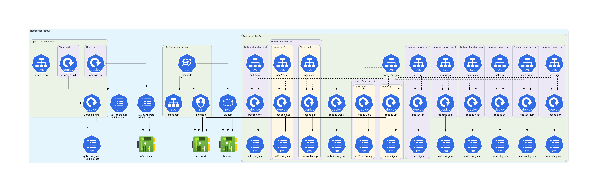

# free5gc-k8s Example

This example is based on **[free5gc-k8s](https://github.com/niloysh/free5gc-k8s)**.

## Instructions

Generate the Kubernetes architecture diagram for **free5gc-k8s** manifests:
```sh
$ ./generate.sh
```

## Generated architecture diagrams

Architecture diagram for **[free5gc-k8s](https://github.com/niloysh/free5gc-k8s)** manifests:

