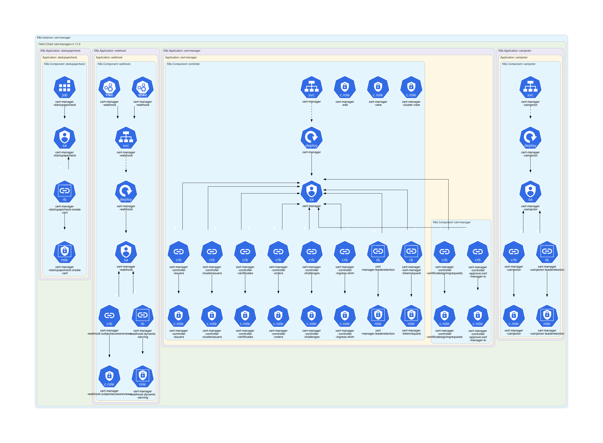
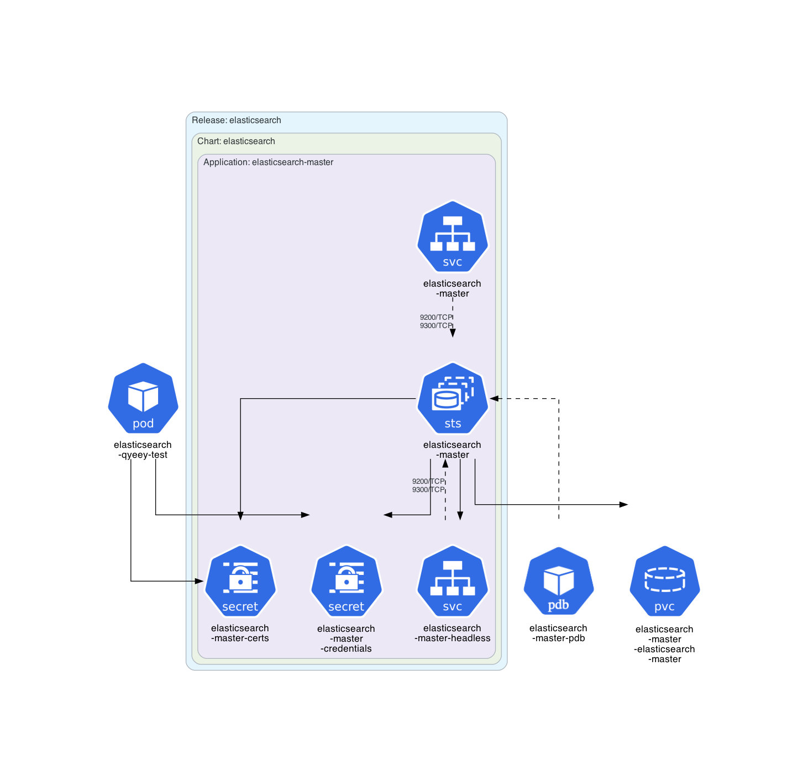
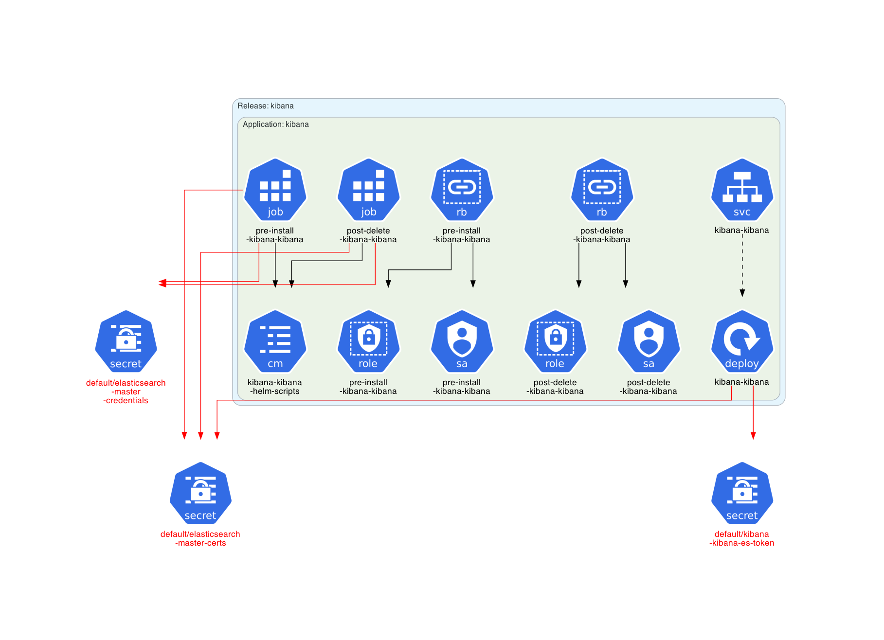
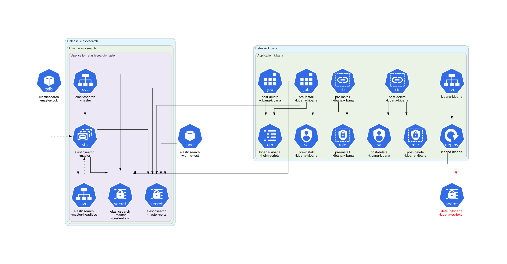
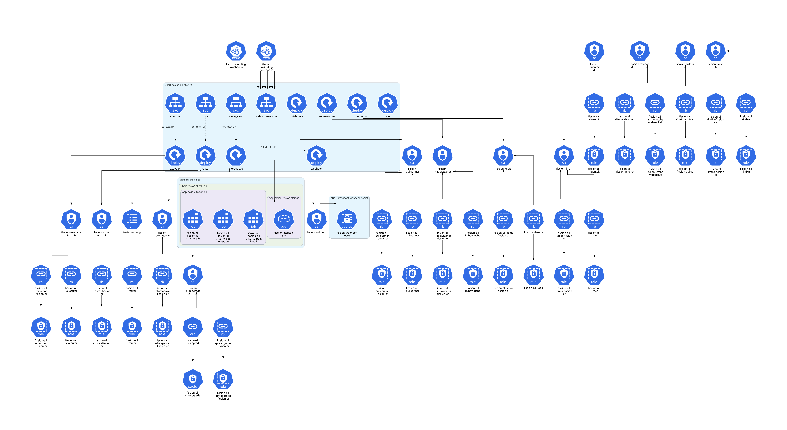
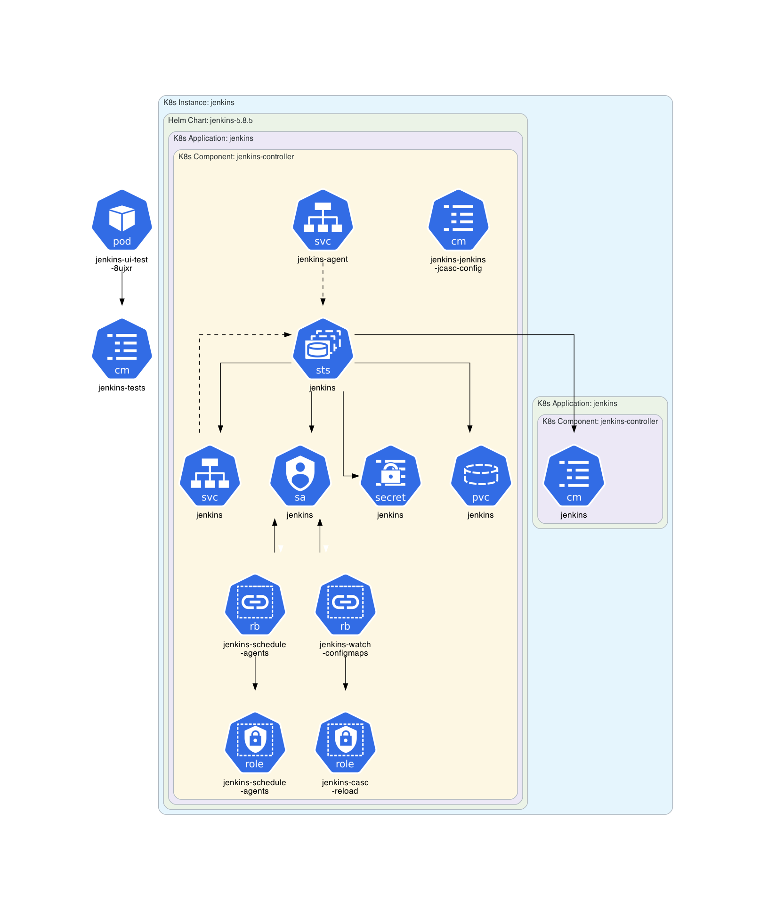

# Some Helm Charts

This example is based on some Helm charts available on **[Artifact Hub](https://artifacthub.io/)**.

## Instructions

Generate the Kubernetes architecture diagrams for some Helm charts:
```sh
$ ./generate.sh
```

## Generated architecture diagrams

Architecture diagram for the **[cert manager Helm chart](https://artifacthub.io/packages/helm/cert-manager/cert-manager)**:


Architecture diagram for the **[Elasticsearch Helm chart](https://artifacthub.io/packages/helm/elastic/elasticsearch)**:


Architecture diagram for the **[Kibana Helm chart](https://artifacthub.io/packages/helm/elastic/kibana)**:


Architecture diagram for both Kibana and Elasticsearch Helm charts:


Architecture diagram for the **[fission-all Helm chart](https://artifacthub.io/packages/helm/fission-charts/fission-all)**:


Architecture diagram for the **[Jenkins chart](https://artifacthub.io/packages/helm/jenkinsci/jenkins)**:

