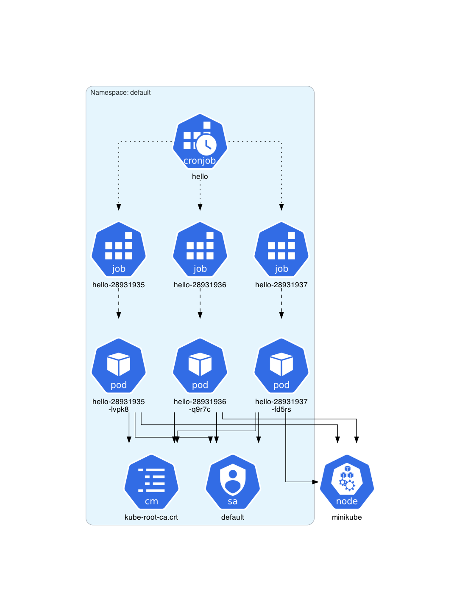
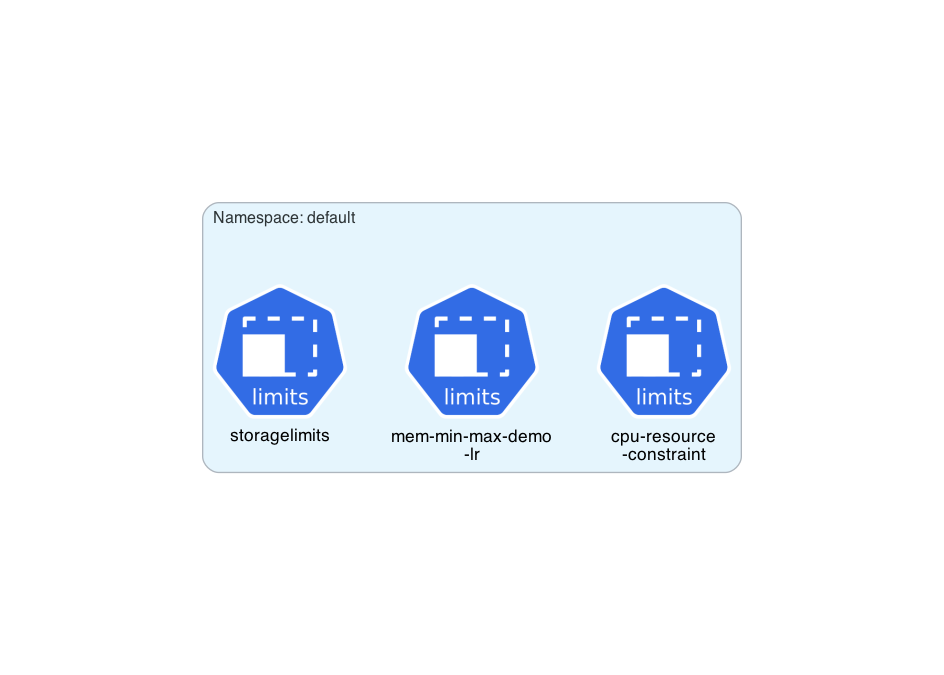
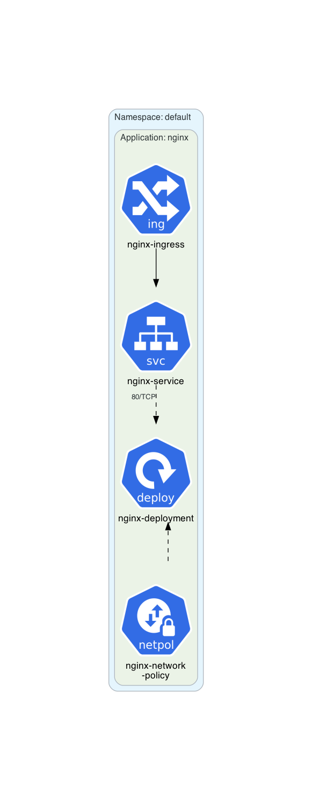
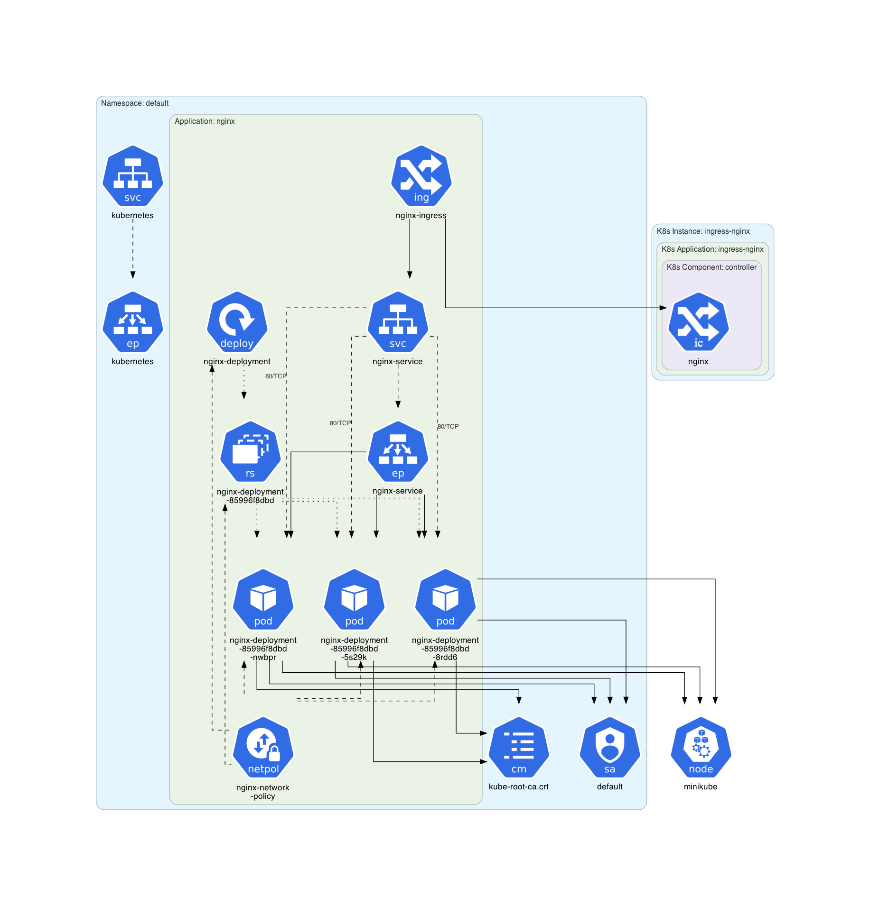
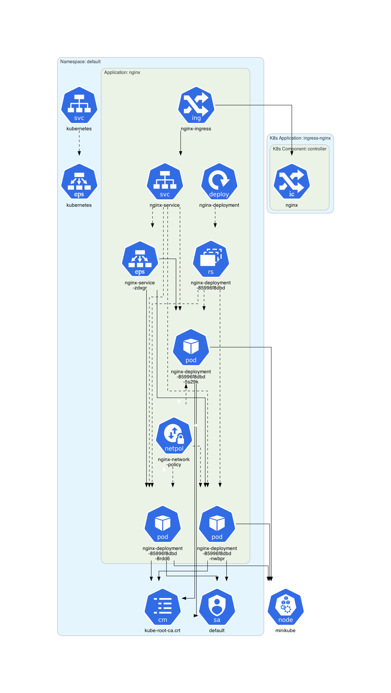
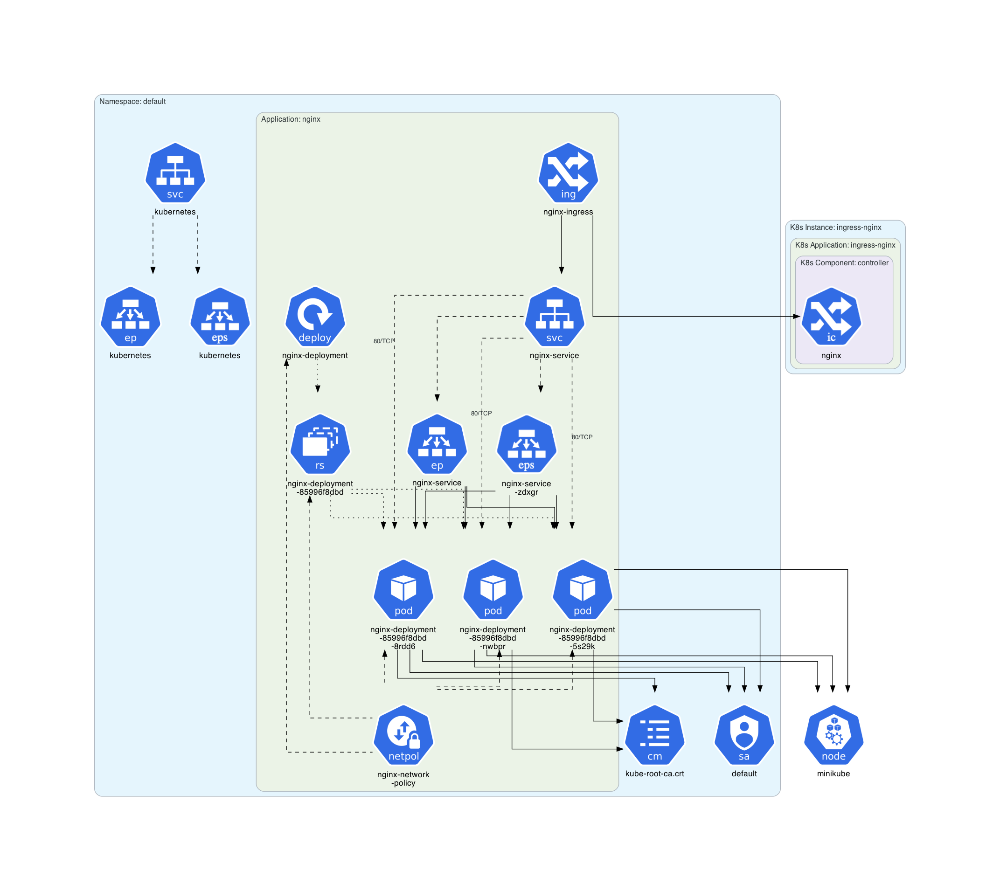
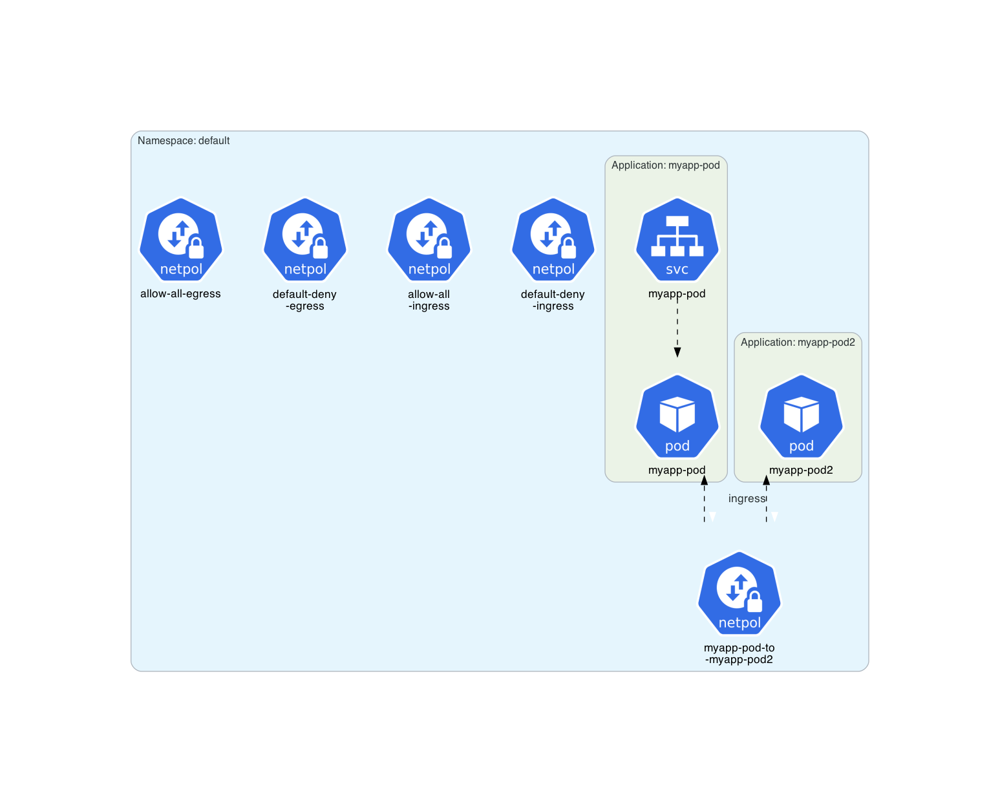
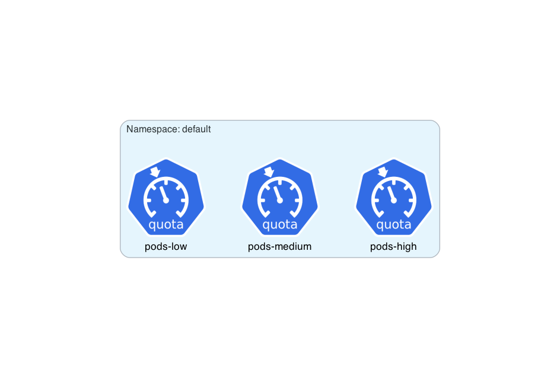
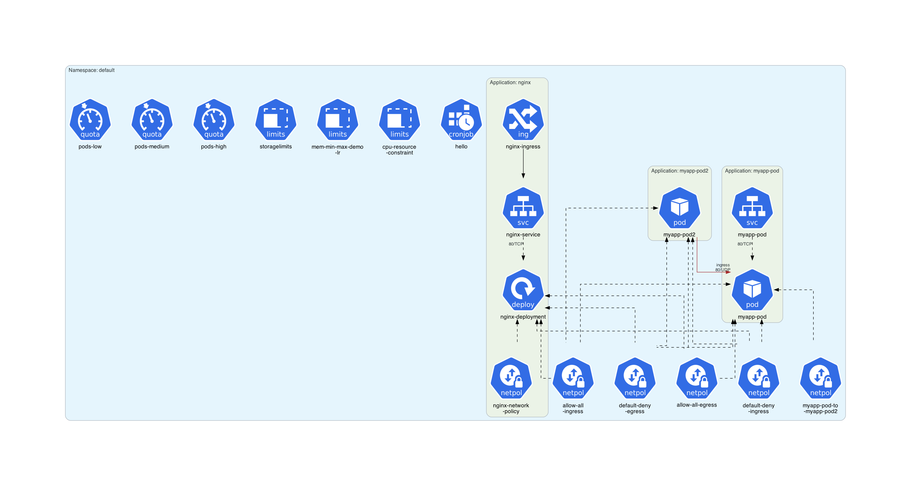

# Miscellaneous Examples

This example provides miscellaneous architecture diagrams for CronJob, LimitRange, NetworkPolicy, and ResourceQuota resource kinds.

## Instructions

Start a Kubernetes cluster.

Generate some miscellaneous architecture diagrams:

```sh
$ ./generate.sh
```

## Generated architecture diagrams

Architecture diagram for [cronjob.yaml](cronjob.yaml):


Architecture diagram for a deployed [cronjob.yaml](cronjob.yaml) instance:


Architecture diagram for [limit-ranges.yaml](limit-ranges.yaml):


Architecture diagram for [nginx.yaml](nginx.yaml):


Architecture diagram for a deployed [nginx.yaml](nginx.yaml) instance showing `Endpoints` resources:


Architecture diagram for a deployed [nginx.yaml](nginx.yaml) instance showing `EndpointSlice` resources:


Architecture diagram for a deployed [nginx.yaml](nginx.yaml) instance showing both `Endpoints` and `EndpointSlice` resources:


Architecture diagram for [network_policies.yaml](network_policies.yaml):


Architecture diagram for [quotas.yaml](quotas.yaml):


All-in-one architecture diagram:

