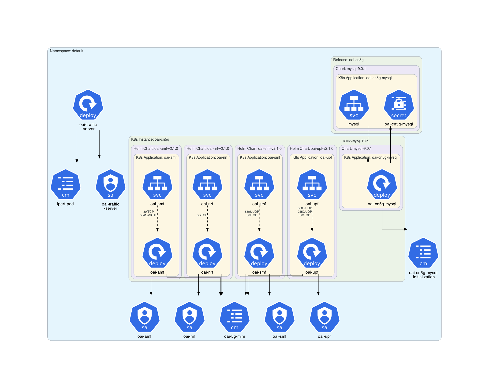
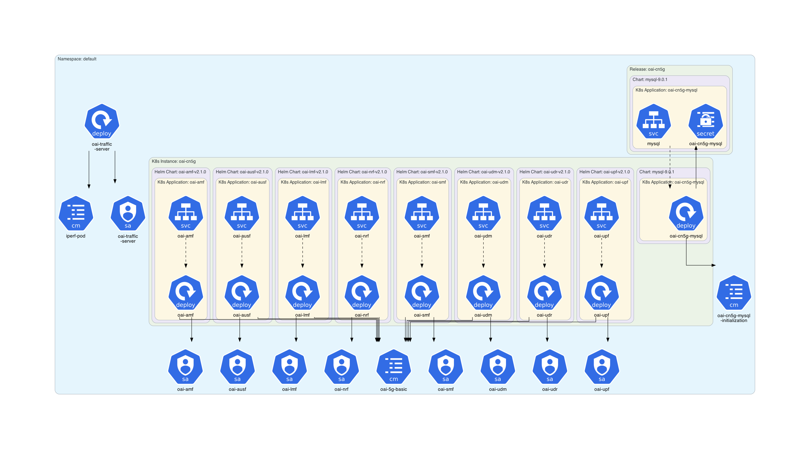
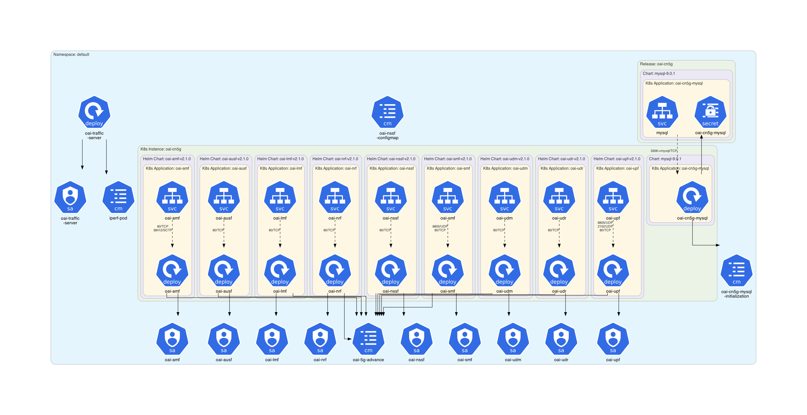
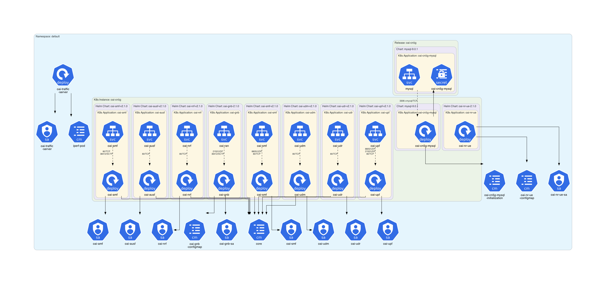
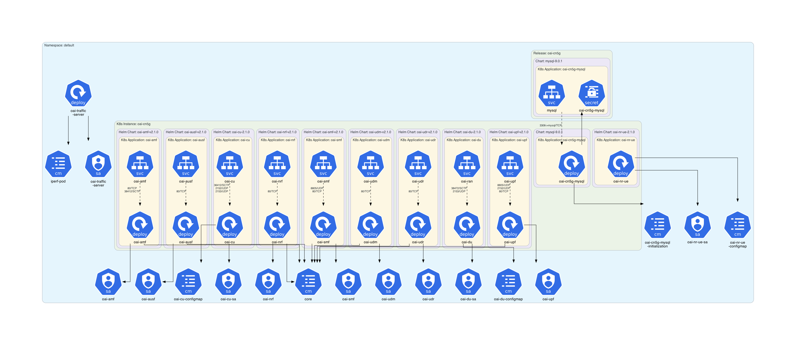
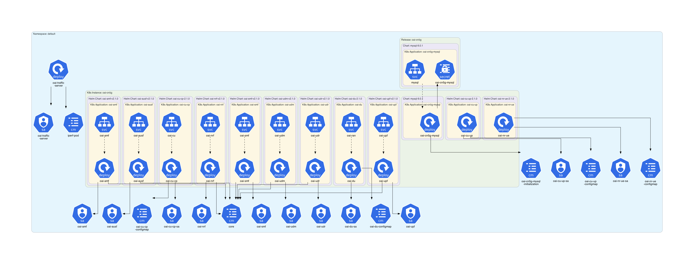

# OpenAirInterface 5G Core Network  Example

This example is based on **[OpenAirInterface 5G Core Network](https://openairinterface.org/oai-5g-core-network-project/)** (OAI-5G-CN).

## Instructions

Generate the Kubernetes architecture diagrams for **OpenAirInterface 5G Core Network** Helm charts:
```sh
$ ./generate.sh
```

## Generated architecture diagrams

Architecture diagram for **[OAI-5G-CN](https://openairinterface.org/oai-5g-core-network-project/)** Minimalist 5GC with AMF, SMF, NRF, and UPF:



Architecture diagram for **[OAI-5G-CN](https://openairinterface.org/oai-5g-core-network-project/)** Basic 5GC with AMF, SMF, NRF, UPF, UDM, AUSF and UDR:



Architecture diagram for **[OAI-5G-CN](https://openairinterface.org/oai-5g-core-network-project/)** Slicing 5GC with AMF, SMF, NRF, UPF, UDM, AUSF, UDR, and NSSF:



Architecture diagram for **[OAI-5G-CN](https://openairinterface.org/oai-5g-core-network-project/)** Use Case 1:



Architecture diagram for **[OAI-5G-CN](https://openairinterface.org/oai-5g-core-network-project/)** Use Case 2:



Architecture diagram for **[OAI-5G-CN](https://openairinterface.org/oai-5g-core-network-project/)** Use Case 3:


