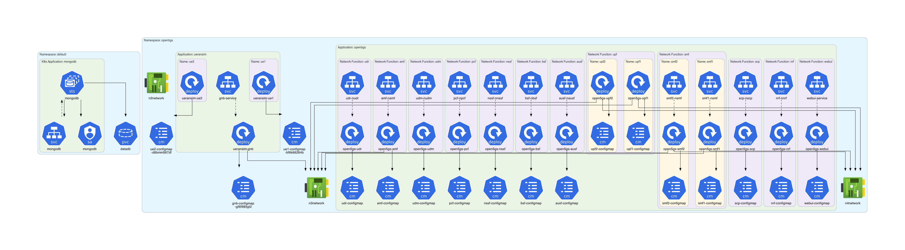

# open5gs-k8s Example

This example is based on **[open5gs-k8s](https://github.com/niloysh/open5gs-k8s)**.

## Instructions

Generate the Kubernetes architecture diagram for **open5gs-k8s** manifests:
```sh
$ ./generate.sh
```

## Generated architecture diagrams

Architecture diagram for **[open5gs-k8s](https://github.com/niloysh/open5gs-k8s)** manifests:

