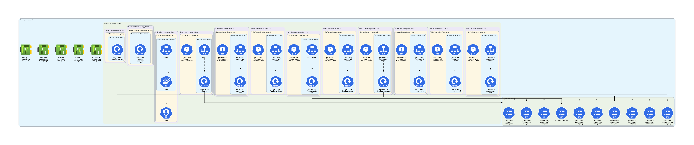
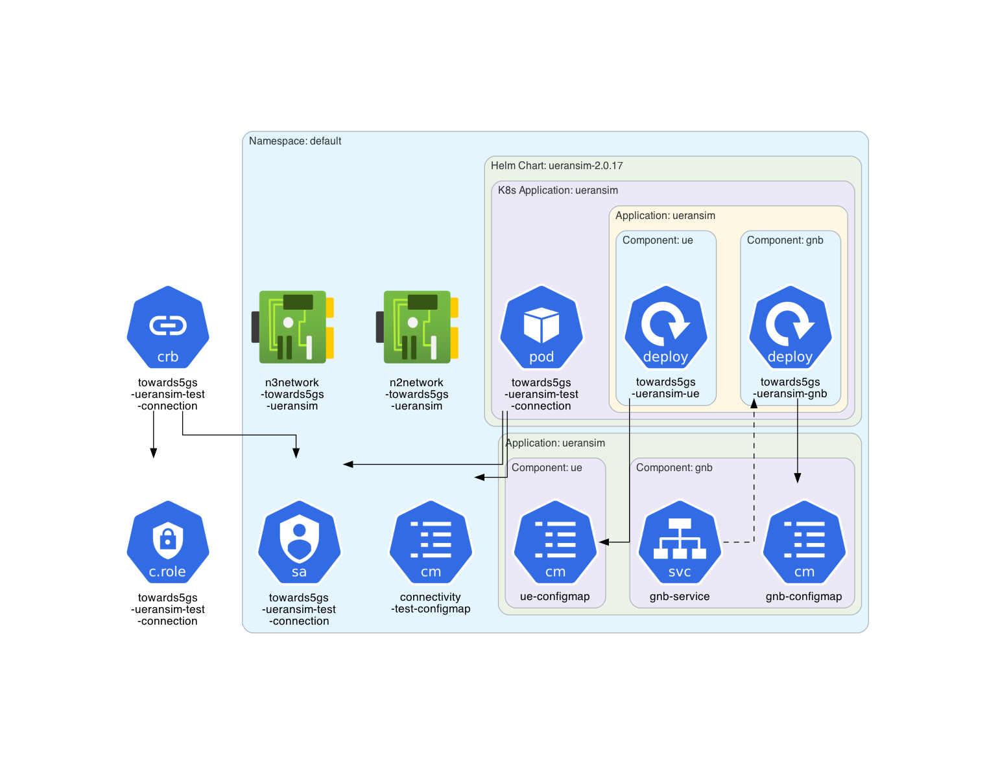
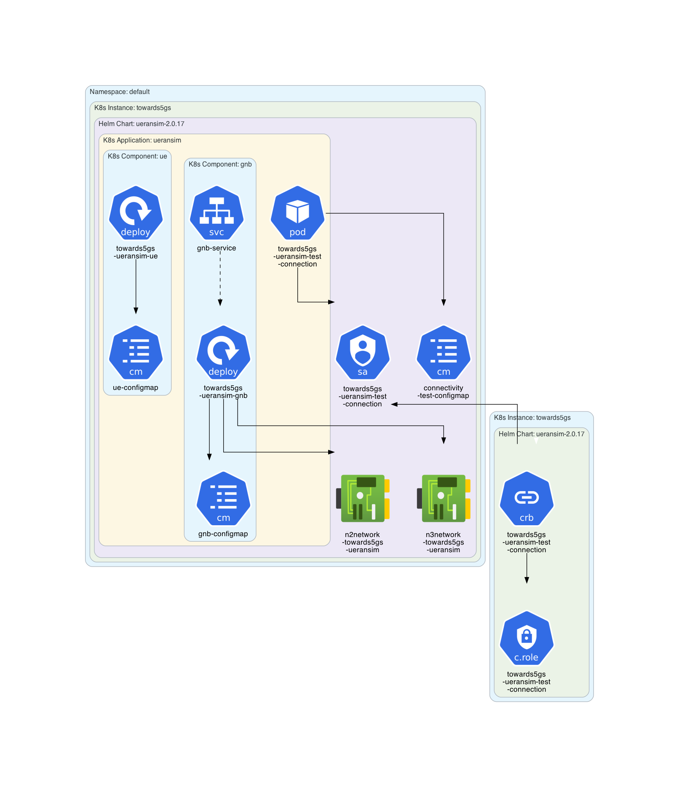
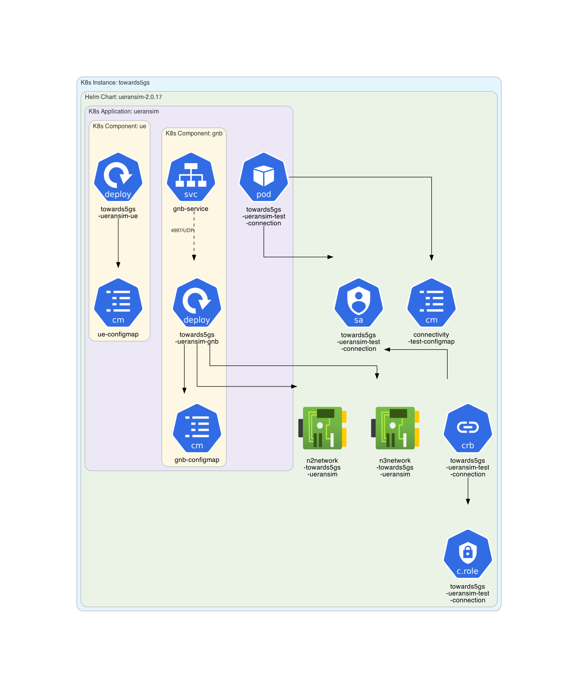

# towards5gs-helm Example

This example is based on **[towards5gs-helm](https://github.com/Orange-OpenSource/towards5gs-helm)**.

## Instructions

Generate the Kubernetes architecture diagrams for **towards5gs-helm** charts:
```sh
$ ./generate.sh
```

## Generated architecture diagrams

Architecture diagram for the  **towards5gs/free5gc** chart:


Architecture diagram for the **towards5gs/ueransim** chart:


**Note**: The previous diagram shows that metadata labels seem to be incorrectly used in the **towards5gs/ueransim** chart. File [towards5gs_ueransim-corrected.yaml](towards5gs_ueransim-corrected.yaml) proposes some possible corrections illustrated in the following diagram.



Same diagram but without namespace:

