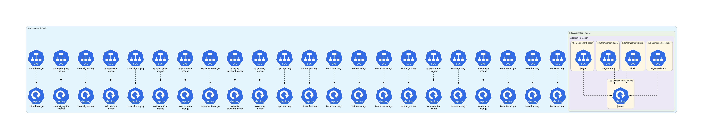
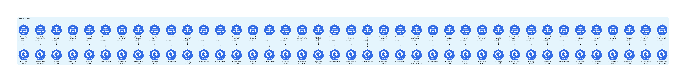
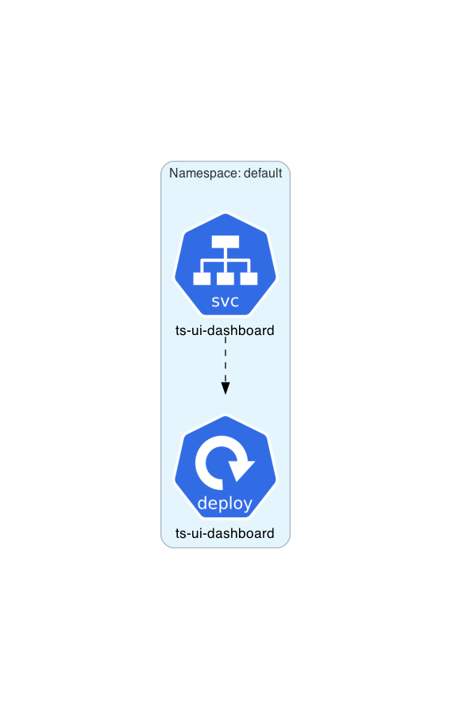

# Train Ticket Example

This example is based on **[Train Ticket：A Benchmark Microservice System](https://github.com/FudanSELab/train-ticket/)**.
Used Train Ticket manifests come from **[here](https://github.com/FudanSELab/train-ticket/tree/master/deployment/kubernetes-manifests/k8s-with-jaeger)**.

## Instructions

Generate the Kubernetes architecture diagrams:
```sh
$ ./generate.sh
```

## Generated architecture diagrams

Architecture diagram for [ts-deployment-part1.yml](ts-deployment-part1.yml):


Architecture diagram for [ts-deployment-part2.yml](ts-deployment-part2.yml):


Architecture diagram for [ts-deployment-part3.yml](ts-deployment-part3.yml):


All-in-one architecture diagram:

