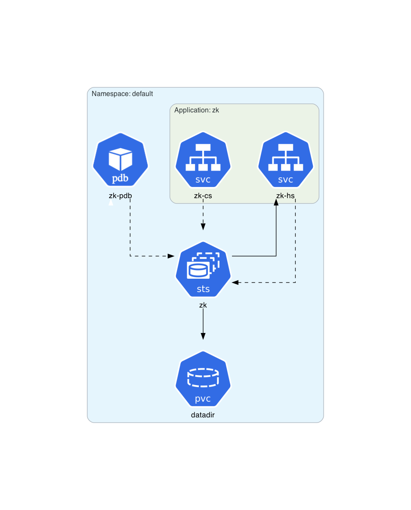
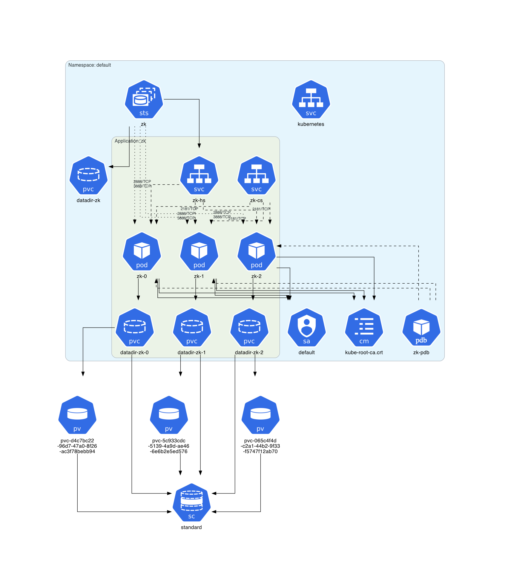

# ZooKeeper Example

This example is based on the **[official Kubernetes ZooKeeper tutorial](https://kubernetes.io/docs/tutorials/stateful-application/zookeeper/)**.

## Instructions

Generate the Kubernetes architecture diagram for the ZooKeeper manifest:
```sh
$ kube-diagrams zookeeper.yaml
```

Start a minikube cluster:
```sh
$ minikube start --node 4
```

Deploy the ZooKeeper application:
```sh
$ kubectl apply -f zookeeper.yaml
```

Wait a few minutes for the ZooKeeper application to be deployed.

Get all Kubernetes resources in the `default` namespace:
```sh
$ kubectl get all,sa,cm,pdb,pvc,pv,sc -o=yaml > namespace_default.yml
```

Generate a Kubernetes architecture diagram for the `default` namespace:
```sh
$ kube-diagrams namespace_default.yml
```

Delete the ZooKeeper application:
```sh
$ kubectl delete -f zookeeper.yaml
```

## Generated architecture diagrams

Architecture diagram for the ZooKeeper manifest:


Architecture diagram for a deployed ZooKeeper instance:

